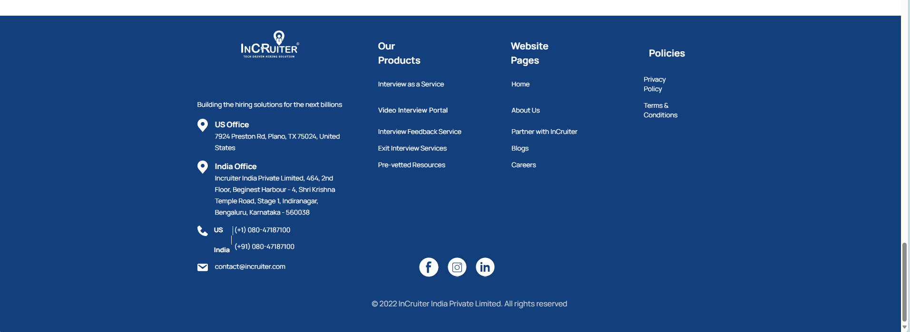

# IncruiterAssigment

This assigment consist of various pages, Home page, Features page, OurWork pages, Reasons, ourOtherProducts and footer page

## Setup Guide
- Clone the project
- Cd to the folder
- Go the project through the terminal and install all dependencies by using typing `npm install` in the terminal
- Run the server using `npm run dev`

## Screenshots

For visualization here's the step by step Guide

### HomePage

### Featured Page

### Why you should choose us?

### Why you should choose us?

### our other products page

### Footer with details

